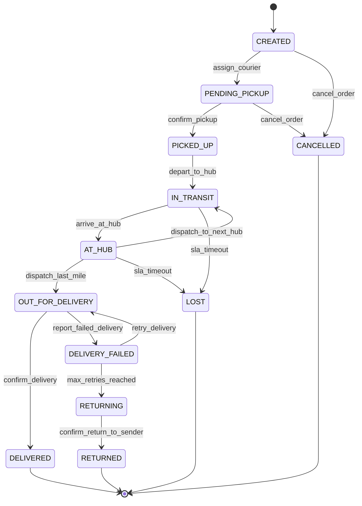
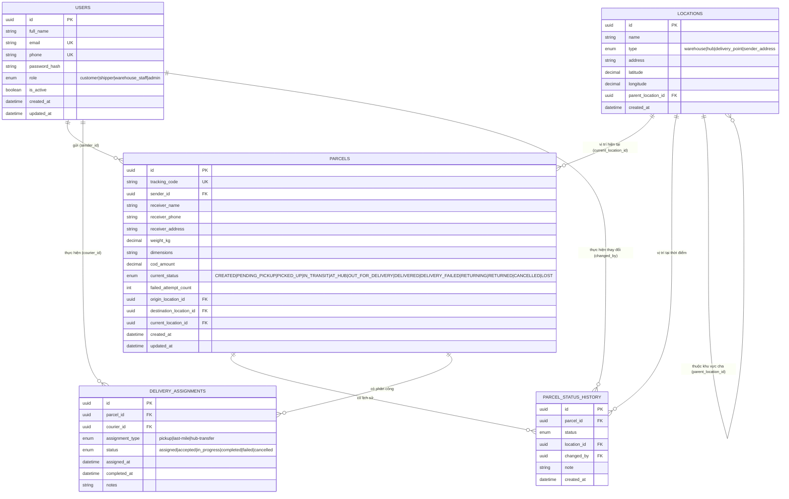

### Bảng mapping: Trạng thái nội bộ ↔ Trạng thái công khai

| Trạng thái nội bộ (internal) | Trạng thái công khai (đề bài) | Ghi chú |
|---|---|---|
| `CREATED` | *(chưa hiển thị / "Order Placed")* | Đơn vừa tạo, chưa xác nhận lấy hàng |
| `PENDING_PICKUP` | *(chưa hiển thị / "Order Placed")* | Đang chờ shipper đến lấy |
| `PICKED_UP` | **Received** | Hệ thống đã nhận hàng từ người gửi |
| `IN_TRANSIT` | **In-Transit** | Đang di chuyển giữa các hub |
| `AT_HUB` | **In-Transit** | Gộp vào In-Transit khi hiển thị công khai (nội bộ vẫn tách riêng để định tuyến) |
| `OUT_FOR_DELIVERY` | **Out for Delivery** | Shipper đang giao chặng cuối |
| `DELIVERED` | **Delivered** | Giao thành công |
| `DELIVERY_FAILED` | **Out for Delivery** (kèm cảnh báo) | Không lộ chi tiết thất bại cho khách, chỉ hiện "đang xử lý lại" |
| `RETURNING` / `RETURNED` | **"Being Returned" / "Returned"** | Trạng thái mở rộng ngoài 4 trạng thái gốc |
| `CANCELLED` | **"Cancelled"** | Trạng thái mở rộng ngoài 4 trạng thái gốc |
| `LOST` | **"Delayed"** (khách) | Ẩn chi tiết "LOST" khỏi khách hàng, chỉ nội bộ mới thấy |
*API gateway (tầng public tracking) sẽ transform trạng thái nội bộ → trạng thái công khai theo bảng trên trước khi trả về cho client M1.*

## 1. User Story + Gherkin
### Danh sách trạng thái parcel (dùng xuyên suốt)
`CREATED → PENDING_PICKUP → PICKED_UP → IN_TRANSIT → AT_HUB → OUT_FOR_DELIVERY → DELIVERED`
Nhánh phụ: `DELIVERY_FAILED`, `RETURNING`, `RETURNED`, `CANCELLED`, `LOST`

### 1.1 Tạo đơn hàng (Create Parcel)
**User Story:** Là một **khách hàng (Sender)**, tôi muốn **tạo một đơn gửi hàng mới** để **hệ thống bắt đầu quy trình vận chuyển**.
```gherkin
Feature: Tạo đơn hàng

  Scenario: Khách hàng tạo đơn hợp lệ
    Given khách hàng đã đăng nhập với vai trò "customer"
    And khách hàng đã nhập đầy đủ thông tin người nhận, địa chỉ, trọng lượng
    When khách hàng gửi yêu cầu tạo đơn
    Then hệ thống tạo parcel mới với trạng thái "CREATED"
    And hệ thống sinh mã tracking_code duy nhất
    And hệ thống ghi một bản ghi vào parcel_status_history với status "CREATED"

  Scenario: Tạo đơn thất bại do thiếu thông tin bắt buộc
    Given khách hàng đã đăng nhập với vai trò "customer"
    And khách hàng bỏ trống địa chỉ người nhận
    When khách hàng gửi yêu cầu tạo đơn
    Then hệ thống từ chối tạo đơn
    And hệ thống trả về lỗi "receiver_address is required"
```
### 1.2 Gán shipper / chờ lấy hàng (Assign courier)
**User Story:** Là một **hệ thống/điều phối viên (Dispatcher)**, tôi muốn **gán đơn hàng cho một shipper** để **shipper có thể đến lấy hàng**.

```gherkin
Feature: Gán shipper lấy hàng

  Scenario: Hệ thống tự động gán shipper gần nhất
    Given parcel đang ở trạng thái "CREATED"
    And có ít nhất 1 shipper đang rảnh (available) gần điểm lấy hàng
    When hệ thống chạy job phân công
    Then parcel chuyển sang trạng thái "PENDING_PICKUP"
    And hệ thống tạo một bản ghi delivery_assignments với status "assigned"
    And hệ thống ghi parcel_status_history với status "PENDING_PICKUP"

  Scenario: Không có shipper khả dụng
    Given parcel đang ở trạng thái "CREATED"
    And không có shipper nào khả dụng trong khu vực
    When hệ thống chạy job phân công
    Then parcel vẫn giữ trạng thái "CREATED"
    And hệ thống đưa parcel vào hàng đợi retry phân công
```
### 1.3 Lấy hàng (Pickup)
**User Story:** Là một **shipper**, tôi muốn **xác nhận đã lấy hàng từ người gửi** để **cập nhật trạng thái đơn**.
```gherkin
Feature: Lấy hàng

  Scenario: Shipper xác nhận lấy hàng thành công
    Given parcel đang ở trạng thái "PENDING_PICKUP"
    And shipper đã được assign cho parcel này
    When shipper quét mã tracking_code và xác nhận "picked up"
    Then parcel chuyển sang trạng thái "PICKED_UP"
    And delivery_assignments tương ứng cập nhật status "in_progress"
    And hệ thống ghi parcel_status_history với status "PICKED_UP" và location hiện tại

  Scenario: Shipper không lấy được hàng (khách hủy tại chỗ)
    Given parcel đang ở trạng thái "PENDING_PICKUP"
    When shipper báo cáo "pickup failed" kèm lý do
    Then parcel vẫn ở trạng thái "PENDING_PICKUP"
    And hệ thống ghi log lý do thất bại
    And hệ thống thử gán lại shipper khác hoặc lên lịch lấy hàng lại
```
### 1.4 Vận chuyển & nhập/xuất kho (In transit / At hub)
**User Story:** Là một **nhân viên kho (Warehouse staff)**, tôi muốn **quét parcel khi nhập/xuất kho** để **theo dõi hành trình vận chuyển**.

```gherkin
Feature: Vận chuyển qua các kho trung chuyển

  Scenario: Parcel bắt đầu vận chuyển sau khi lấy hàng
    Given parcel đang ở trạng thái "PICKED_UP"
    When shipper giao parcel cho điểm trung chuyển đầu tiên
    Then parcel chuyển sang trạng thái "IN_TRANSIT"
    And hệ thống ghi parcel_status_history với status "IN_TRANSIT"

  Scenario: Parcel đến kho trung chuyển
    Given parcel đang ở trạng thái "IN_TRANSIT"
    When nhân viên kho quét parcel nhập kho tại một location loại "hub"
    Then parcel chuyển sang trạng thái "AT_HUB"
    And parcel.current_location_id được cập nhật theo location vừa quét
    And hệ thống ghi parcel_status_history kèm location_id

  Scenario: Parcel được điều chuyển tiếp sang kho khác
    Given parcel đang ở trạng thái "AT_HUB"
    And parcel chưa đến kho gần điểm giao cuối cùng
    When nhân viên kho xuất kho để chuyển tiếp
    Then parcel chuyển về trạng thái "IN_TRANSIT"
    And hệ thống ghi parcel_status_history tương ứng

  Scenario: Parcel đến kho cuối, sẵn sàng giao
    Given parcel đang ở trạng thái "AT_HUB"
    And location hiện tại là kho phụ trách khu vực giao hàng cuối
    When điều phối viên gán shipper giao hàng
    Then parcel chuyển sang trạng thái "OUT_FOR_DELIVERY"
    And hệ thống tạo delivery_assignments mới (loại "last-mile") với status "assigned"
```
### 1.5 Giao hàng thành công (Delivered)
**User Story:** Là một **shipper**, tôi muốn **xác nhận giao hàng thành công** để **kết thúc vòng đời đơn hàng**.

```gherkin
Feature: Giao hàng thành công

  Scenario: Giao hàng thành công, có xác nhận của người nhận
    Given parcel đang ở trạng thái "OUT_FOR_DELIVERY"
    And shipper đã đến địa chỉ người nhận
    When shipper xác nhận giao hàng thành công (có ảnh/chữ ký)
    Then parcel chuyển sang trạng thái "DELIVERED"
    And delivery_assignments cập nhật status "completed" và completed_at = thời điểm hiện tại
    And hệ thống ghi parcel_status_history với status "DELIVERED"
    And hệ thống gửi thông báo cho customer
```
### 1.6 Giao hàng thất bại & thử lại (Failed delivery & retry)
**User Story:** Là một **shipper**, tôi muốn **báo cáo giao hàng thất bại** để **hệ thống lên lịch giao lại hoặc xử lý hoàn trả**.

```gherkin
Feature: Giao hàng thất bại

  Scenario: Giao thất bại, còn lượt thử lại
    Given parcel đang ở trạng thái "OUT_FOR_DELIVERY"
    And số lần thất bại hiện tại < giới hạn tối đa (ví dụ 3)
    When shipper báo cáo "delivery failed" (khách không nghe máy/không có ở nhà)
    Then parcel chuyển sang trạng thái "DELIVERY_FAILED"
    And hệ thống ghi parcel_status_history kèm lý do thất bại
    And hệ thống lên lịch giao lại, parcel quay về "OUT_FOR_DELIVERY" ở lượt kế tiếp

  Scenario: Giao thất bại, đã hết số lần thử lại
    Given parcel đang ở trạng thái "DELIVERY_FAILED"
    And số lần thất bại đã đạt giới hạn tối đa
    When hệ thống đánh giá không thể giao tiếp
    Then parcel chuyển sang trạng thái "RETURNING"
    And hệ thống ghi parcel_status_history với status "RETURNING"
```
### 1.7 Hoàn trả (Return)

**User Story:** Là một **hệ thống**, tôi muốn **hoàn trả parcel về người gửi** khi **không thể giao thành công**.

```gherkin
Feature: Hoàn trả hàng

  Scenario: Parcel được hoàn trả thành công cho người gửi
    Given parcel đang ở trạng thái "RETURNING"
    When shipper xác nhận đã giao lại parcel cho người gửi (sender)
    Then parcel chuyển sang trạng thái "RETURNED"
    And hệ thống ghi parcel_status_history với status "RETURNED"
    And hệ thống đóng mọi delivery_assignments còn mở với status "completed" (loại return)
```
### 1.8 Hủy đơn (Cancel)
**User Story:** Là một **khách hàng**, tôi muốn **hủy đơn hàng trước khi được lấy** để **không phát sinh chi phí vận chuyển**.

```gherkin
Feature: Hủy đơn hàng

  Scenario: Hủy đơn thành công trước khi lấy hàng
    Given parcel đang ở trạng thái "CREATED" hoặc "PENDING_PICKUP"
    When khách hàng yêu cầu hủy đơn
    Then parcel chuyển sang trạng thái "CANCELLED"
    And hệ thống ghi parcel_status_history với status "CANCELLED"
    And mọi delivery_assignments liên quan (nếu có) được hủy

  Scenario: Không thể hủy đơn sau khi đã lấy hàng
    Given parcel đang ở trạng thái "PICKED_UP" hoặc trạng thái sau đó
    When khách hàng yêu cầu hủy đơn
    Then hệ thống từ chối yêu cầu hủy
    And hệ thống trả về lỗi "parcel cannot be cancelled after pickup"
```
### 1.9 Thất lạc / hư hỏng (Lost / Damaged)
**User Story:** Là một **nhân viên kho hoặc hệ thống giám sát**, tôi muốn **đánh dấu parcel bị thất lạc** để **kích hoạt quy trình xử lý khiếu nại**.

```gherkin
Feature: Xử lý parcel thất lạc

  Scenario: Parcel không được quét trong thời gian quá hạn quy định
    Given parcel đang ở trạng thái "IN_TRANSIT" hoặc "AT_HUB"
    And parcel không có cập nhật trạng thái nào trong hơn 72 giờ
    When hệ thống chạy job kiểm tra SLA
    Then parcel chuyển sang trạng thái "LOST"
    And hệ thống ghi parcel_status_history với status "LOST"
    And hệ thống mở một ticket khiếu nại và thông báo cho customer
```

## 2. State Machine

### 2.1 Sơ đồ trạng thái



### 2.2 Transition table đầy đủ

| # | From state | To state | Event / Trigger | Actor | Điều kiện (Guard) | Hiệu ứng phụ (Side effect) |
|---|---|---|---|---|---|---|
| 1 | — | `CREATED` | `create_parcel` | Customer | Thông tin đơn hợp lệ | Sinh `tracking_code`; ghi `parcel_status_history` |
| 2 | `CREATED` | `PENDING_PICKUP` | `assign_courier` | Dispatcher / System | Có shipper khả dụng | Tạo `delivery_assignments` (status=assigned) |
| 3 | `CREATED` | `CANCELLED` | `cancel_order` | Customer | Chưa được assign | Ghi lý do hủy |
| 4 | `PENDING_PICKUP` | `PICKED_UP` | `confirm_pickup` | Shipper | Shipper đúng người được assign | Cập nhật `delivery_assignments.status=in_progress` |
| 5 | `PENDING_PICKUP` | `CANCELLED` | `cancel_order` | Customer | Chưa lấy hàng | Hủy `delivery_assignments` liên quan |
| 6 | `PICKED_UP` | `IN_TRANSIT` | `depart_to_hub` | Shipper / System | — | Cập nhật `current_location_id` |
| 7 | `IN_TRANSIT` | `AT_HUB` | `arrive_at_hub` | Warehouse staff | Quét tại location loại `hub` | Cập nhật `current_location_id`, ghi lịch sử |
| 8 | `IN_TRANSIT` | `LOST` | `sla_timeout` | System (job) | Không có cập nhật > ngưỡng SLA | Mở ticket khiếu nại |
| 9 | `AT_HUB` | `IN_TRANSIT` | `dispatch_to_next_hub` | Warehouse staff | Chưa đến hub cuối | Cập nhật `current_location_id` đích tiếp theo |
| 10 | `AT_HUB` | `OUT_FOR_DELIVERY` | `dispatch_last_mile` | Dispatcher | Đến hub phụ trách khu vực giao | Tạo `delivery_assignments` (loại last-mile) |
| 11 | `AT_HUB` | `LOST` | `sla_timeout` | System (job) | Không có cập nhật > ngưỡng SLA | Mở ticket khiếu nại |
| 12 | `OUT_FOR_DELIVERY` | `DELIVERED` | `confirm_delivery` | Shipper | Có bằng chứng giao (ảnh/chữ ký) | `delivery_assignments.status=completed`; thông báo customer |
| 13 | `OUT_FOR_DELIVERY` | `DELIVERY_FAILED` | `report_failed_delivery` | Shipper | — | Ghi lý do thất bại, tăng `failed_attempt_count` |
| 14 | `DELIVERY_FAILED` | `OUT_FOR_DELIVERY` | `retry_delivery` | System (scheduler) | `failed_attempt_count` < max (vd 3) | Lên lịch giao lại |
| 15 | `DELIVERY_FAILED` | `RETURNING` | `max_retries_reached` | System | `failed_attempt_count` >= max | Thông báo customer về việc hoàn trả |
| 16 | `RETURNING` | `RETURNED` | `confirm_return_to_sender` | Shipper | Đã giao lại cho sender | Đóng mọi `delivery_assignments` còn mở |
**Ghi chú quy tắc chung:**
- Mọi transition đều tạo **một bản ghi mới** trong `parcel_status_history` (không update, chỉ insert — dùng để audit/tra cứu lịch sử đầy đủ).
- Các trạng thái cuối (**terminal states**): `DELIVERED`, `CANCELLED`, `RETURNED`, `LOST` — không có transition đi ra (trừ trường hợp nghiệp vụ đặc biệt như khiếu nại `LOST` được tìm lại, có thể thiết kế thêm nếu cần).
- `CANCELLED` chỉ được phép từ `CREATED` hoặc `PENDING_PICKUP` (chưa lấy hàng) theo rule ở Gherkin mục 1.8.
---

## 3. ERD (Entity Relationship Diagram)
### 3.1 Sơ đồ


### 3.2 Mô tả chi tiết bảng

**users**
| Cột | Kiểu | Ghi chú |
|---|---|---|
| id | UUID (PK) | |
| full_name | VARCHAR | |
| email | VARCHAR, UNIQUE | |
| phone | VARCHAR, UNIQUE | |
| password_hash | VARCHAR | |
| role | ENUM | `customer`, `shipper`, `warehouse_staff`, `admin` |
| is_active | BOOLEAN | |
| created_at / updated_at | TIMESTAMP | |

**parcels**
| Cột | Kiểu | Ghi chú |
|---|---|---|
| id | UUID (PK) | |
| tracking_code | VARCHAR, UNIQUE | Mã tra cứu công khai |
| sender_id | UUID (FK → users.id) | |
| receiver_name / phone / address | VARCHAR | Người nhận không nhất thiết có tài khoản |
| weight_kg, dimensions | DECIMAL/VARCHAR | |
| cod_amount | DECIMAL | Tiền thu hộ (nếu có) |
| current_status | ENUM | Trạng thái hiện tại (denormalize để query nhanh, nguồn sự thật đầy đủ nằm ở `parcel_status_history`) |
| failed_attempt_count | INT | Đếm số lần giao thất bại |
| origin_location_id, destination_location_id, current_location_id | UUID (FK → locations.id) | |
| created_at / updated_at | TIMESTAMP | |

**parcel_status_history**
| Cột | Kiểu | Ghi chú |
|---|---|---|
| id | UUID (PK) | |
| parcel_id | UUID (FK → parcels.id) | |
| status | ENUM | Trạng thái tại thời điểm ghi nhận |
| location_id | UUID (FK → locations.id), nullable | |
| changed_by | UUID (FK → users.id), nullable | Null nếu do hệ thống tự động (job SLA...) |
| note | TEXT | Lý do / mô tả thêm |
| created_at | TIMESTAMP | |

*Bảng này chỉ INSERT, không UPDATE/DELETE — dùng làm audit log & để build lại trạng thái tại bất kỳ thời điểm nào.*

**locations**
| Cột | Kiểu | Ghi chú |
|---|---|---|
| id | UUID (PK) | |
| name | VARCHAR | |
| type | ENUM | `warehouse`, `hub`, `delivery_point`, `sender_address` |
| address | VARCHAR | |
| latitude / longitude | DECIMAL | |
| parent_location_id | UUID (FK → locations.id), nullable | Cho phép phân cấp khu vực (vùng → tỉnh → kho) |
| created_at | TIMESTAMP | |

**delivery_assignments**
| Cột | Kiểu | Ghi chú |
|---|---|---|
| id | UUID (PK) | |
| parcel_id | UUID (FK → parcels.id) | |
| courier_id | UUID (FK → users.id, role=shipper) | |
| assignment_type | ENUM | `pickup`, `last-mile`, `hub-transfer` |
| status | ENUM | `assigned`, `accepted`, `in_progress`, `completed`, `failed`, `cancelled` |
| assigned_at / completed_at | TIMESTAMP | |
| notes | TEXT | |

### 3.3 Quan hệ chính
- `users (1) — (n) parcels` qua `sender_id`: một khách hàng có thể tạo nhiều đơn.
- `users (1) — (n) delivery_assignments` qua `courier_id`: một shipper có thể được gán nhiều lần giao/lấy hàng.
- `parcels (1) — (n) parcel_status_history`: một đơn có nhiều bản ghi lịch sử trạng thái (audit trail).
- `parcels (1) — (n) delivery_assignments`: một đơn có thể có nhiều phân công (lấy hàng, chuyển kho, giao cuối) trong vòng đời của nó.
- `locations (1) — (n) parcels` qua `current_location_id`: một địa điểm có thể đang chứa nhiều parcel tại một thời điểm.
- `locations (1) — (n) locations` qua `parent_location_id`: quan hệ đệ quy để phân cấp vùng/kho (tùy chọn, hữu ích cho định tuyến).